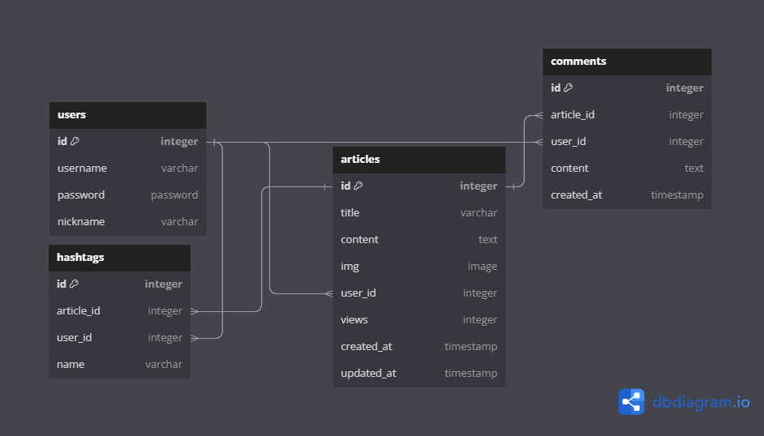

# my-dev-blog

My Dev Blog with Django.

## 기능

1. Users: 회원가입, 로그인
2. Articles: CRUD, 이미지 업로드, 조회수
    - Comments, Hashtags

## 개발환경

-   Requirements.txt

    ```
    asgiref==3.7.2
    Django==4.2.3
    django-bootstrap5==23.3
    Pillow==10.0.0
    python-decouple==3.8
    sqlparse==0.4.4
    tzdata==2023.3
    ```

-   SECRET_KEY 설정

    ```py
    # core/settings.py
    from decouple import config, Csv
    SECRET_KEY = config('SECRET_KEY')
    DEBUG = config('DEBUG', cast=bool, default=False)
    ALLOWED_HOSTS = config('ALLOWED_HOSTS', cast=Csv())

    # BASE_DIR/.env
    DEBUG = True
    SECRET_KEY = 'mysecretkey'
    ALLOWED_HOSTS = "*"
    ```

## 구조

```
mid-myblog
├─ articles
│  ├─ admin.py
│  ├─ apps.py
│  ├─ forms.py
│  ├─ migrations
│  ├─ models.py
│  ├─ templates
│  │  └─ articles
│  │     ├─ detail.html
│  │     ├─ edit.html
│  │     ├─ form_error.html
│  │     ├─ list.html
│  │     └─ write.html
│  ├─ tests.py
│  ├─ urls.py
│  ├─ views.py
│  └─ __init__.py
├─ core
│  ├─ asgi.py
│  ├─ settings.py
│  ├─ urls.py
│  ├─ views.py
│  ├─ wsgi.py
│  └─ __init__.py
└─ users
│  ├─ admin.py
│  ├─ apps.py
│  ├─ forms.py
│  ├─ migrations
│  ├─ models.py
│  ├─ templates
│  │  └─ users
│  │     ├─ login.html
│  │     └─ signup.html
│  ├─ tests.py
│  ├─ urls.py
│  ├─ views.py
│  └─ __init__.py
├─ manage.py
├─ README.md
├─ requirements.txt
├─ .env
├─ templates
│  ├─ base.html
│  └─ main.html
```

## 모델



## URL

```py
# Admin
"admin/": django admin page

# Main
"": 블로그 시작 페이지

# Users
"users/signup/": 회원가입
"users/login/": 로그인
"users/logout/": 로그아웃

# Articles
"articles/": 글 목록 조회
"articles/detail/<int:pk>/": 글 상세 조회
"articles/write/": 글 작성
"articles/detail/<int:pk>/edit/": 글 수정
"articles/detail/<int:pk>/delete/": 글 삭제
"articles/detail/<int:pk>/comment/write/": 코멘트 작성
"articles/detail/comment/<int:pk>/delete/": 코멘트 삭제
"articles/detail/<int:pk>/hashtag/write/": 해쉬태그 작성
"articles/detail/<int:pk>/hashtag/delete/": 해쉬태그 삭제
```

## TODO

-   조회수 제대로 작동하도록 수정
-   이미지 여러개 올릴 수 있도록 models 추가 등 수정
-   게시글 검색 기능
-   게시글 정렬 기능
-   Bootstrap 탬플릿 적용
-   Navbar 추가
-   배포
